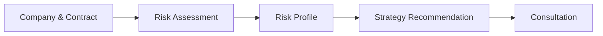

# dongkk-frontend

> Frontend for **청심환**, an AI-powered FX risk diagnosis platform for small and medium-sized import/export businesses.

`dongkk-frontend`는 계약 정보 입력부터 환리스크 진단, 리스크 성향 분석, 대응 전략 및 금융상품 추천, 상담 신청까지의 전체 사용자 경험을 제공하는 Next.js 기반 웹 애플리케이션입니다.

실제 환율 예측, 리스크 분석, 추천 로직은 별도의 백엔드 및 AI 서비스에서 수행하며, 이 레포는 그 결과를 사용자가 이해하기 쉬운 형태로 시각화하고 상호작용을 제공합니다.

---

## ✨ Features

### Wizard Flow

사용자는 하나의 흐름 안에서 환리스크 진단부터 상담 신청까지 진행합니다.

| Step  | Description                   |
| ----- | ----------------------------- |
| **1** | 회사 및 계약 정보 입력        |
| **2** | AI 기반 환리스크 진단         |
| **3** | 기업 리스크 성향 분석         |
| **4** | 대응 전략 및 KB 금융상품 추천 |
| **5** | 상담 신청                     |



---

## 🏗 Architecture

서비스는 세 개의 레포로 구성되어 있으며, 이 레포는 사용자와 직접 상호작용하는 프론트엔드입니다.

```mermaid
flowchart LR

subgraph Frontend
FE[dongkk-frontend]
end

subgraph Backend
SERVER[dongkk-server]
end

subgraph AI
AI[dongkk-ai / fx-chronos]
end

FE -->|REST API| SERVER
SERVER -->|Prediction| AI
```

### Repository Roles

| Repository                 | Responsibility                              |
| -------------------------- | ------------------------------------------- |
| **dongkk-frontend**        | UI, Wizard Flow, Result Visualization       |
| **dongkk-server**          | Business Logic, API, Recommendation         |
| **dongkk-ai / fx-chronos** | Exchange Rate Forecasting & Risk Simulation |

브라우저 요청은 Next.js Rewrite를 통해 `/backend-api/*` 경로로 프록시되며, 이를 통해 별도의 CORS 설정 없이 백엔드와 통신합니다.

---

## 🛠 Tech Stack

| Category         | Technology              |
| ---------------- | ----------------------- |
| Framework        | Next.js 16 (App Router) |
| Language         | TypeScript, React 19    |
| Styling          | Tailwind CSS v4         |
| State Management | React Context           |
| Charts           | Recharts                |
| Testing          | Vitest                  |

---

## 🚀 Quick Start

### Install

```bash
npm install
```

### Environment Variables

```bash
cp .env.example .env.local
```

| Variable                 | Description                                    |
| ------------------------ | ---------------------------------------------- |
| BACKEND_API_URL          | Backend API endpoint used by Next.js rewrite   |
| NEXT_PUBLIC_API_BASE_URL | Client API base path (default: `/backend-api`) |

### Run

```bash
npm run dev
```

### Build

```bash
npm run build
npm run start
```

---

## 📂 Project Structure

```
src
├── app                # App Router pages
├── components         # Shared UI components
├── context            # Wizard state
├── hooks              # Custom hooks
├── lib
│   ├── api            # API layer
│   ├── risk.ts
│   ├── date.ts
│   └── countries.ts
```

---

## 🔄 State Management

전체 Wizard 상태는 `WizardProvider`를 통해 관리됩니다.

관리되는 주요 데이터는 다음과 같습니다.

- 회사 정보
- 계약 정보
- 환리스크 진단 결과
- 리스크 성향 분석 결과
- 추천 전략
- 추천 금융상품
- 상담 신청 정보

상태는 React Context에 저장되며 별도의 영속화는 하지 않습니다. 따라서 새로고침 시 Wizard는 처음부터 다시 시작됩니다.

---

## 🔌 API Layer

모든 API 호출은 `src/lib/api` 아래에서 관리됩니다.

| File         | Responsibility                    |
| ------------ | --------------------------------- |
| `client.ts`  | Fetch wrapper & error handling    |
| `mappers.ts` | snake_case ↔ camelCase mapping    |
| `labels.ts`  | Enum/code → Display label mapping |
| `types.ts`   | Request & Response types          |

이 구조를 통해 화면은 API 구현 세부사항과 분리되어 있으며, 백엔드 응답 형식이 변경되더라도 영향을 최소화할 수 있습니다.

---

## 🧪 Testing

Vitest를 사용하여 순수 함수 중심의 유닛 테스트를 수행합니다.

```bash
npm run test
```

현재 테스트 대상

- API Mapping
- Risk Aggregation
- Formatting Utilities

---

## 📜 Available Scripts

| Command         | Description              |
| --------------- | ------------------------ |
| `npm run dev`   | Start development server |
| `npm run build` | Production build         |
| `npm run start` | Start production server  |
| `npm run lint`  | ESLint                   |
| `npm run test`  | Run Vitest               |

---

## 📄 License

Private project.
