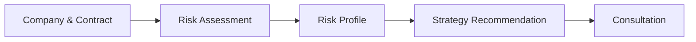
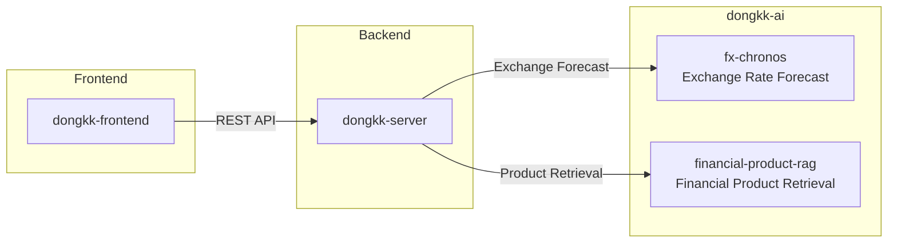
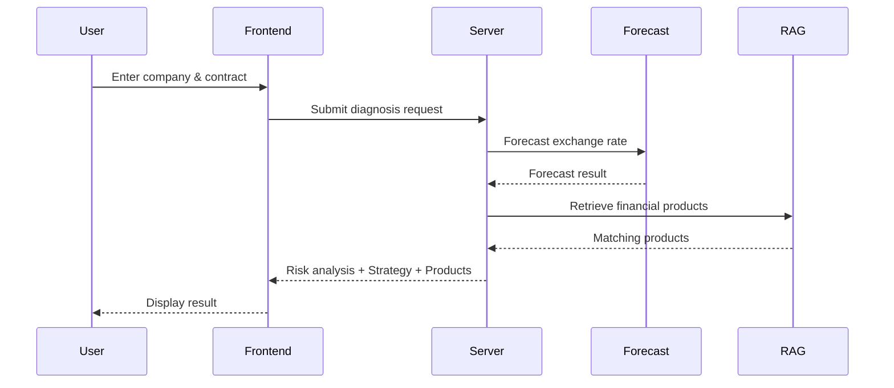

# dongkk-frontend

> Frontend for **청심환**, an AI-powered FX risk diagnosis platform for small and medium-sized import/export businesses.

`dongkk-frontend`는 계약 정보 입력부터 환리스크 진단, 리스크 성향 분석, 대응 전략 및 금융상품 추천, 상담 신청까지의 전체 사용자 경험을 제공하는 Next.js 기반 웹 애플리케이션입니다.

실제 환율 예측과 금융상품 검색은 AI 서비스에서 수행하며, 리스크 분석과 전략 생성은 백엔드에서 처리합니다. 이 레포는 분석 결과를 사용자가 이해하기 쉬운 형태로 시각화하고 상호작용을 제공합니다.

---

## ✨ Features

사용자는 하나의 Wizard Flow를 따라 환리스크를 진단하고 대응 전략을 확인할 수 있습니다.

| Step | Description |
|------|-------------|
| **1** | 회사 및 계약 정보 입력 |
| **2** | AI 기반 환리스크 진단 |
| **3** | 기업 리스크 성향 분석 |
| **4** | 대응 전략 및 KB 금융상품 추천 |
| **5** | 상담 신청 |



---

## 🏗️ Architecture

서비스는 세 개의 레포지토리로 구성되어 있으며, 이 레포는 사용자와 직접 상호작용하는 프론트엔드입니다.



### Responsibilities

| Component | Responsibility |
|----------|----------------|
| **dongkk-frontend** | UI, Wizard Flow, Result Visualization |
| **dongkk-server** | REST API, Domain Logic, Strategy Rules |
| **fx-chronos** | Exchange Rate Forecasting & Hedge Simulation |
| **financial-product-rag** | Financial Product Retrieval & Matching |

- **Strategy generation** (hedging strategy and allocation ratio) is implemented by rule-based logic in `dongkk-server`.
- **AI services** are responsible for exchange rate forecasting and financial product retrieval.
- Browser requests are proxied through Next.js Rewrite (`/backend-api/*`) to avoid CORS issues.

---

## 🔄 Request Flow



---

## 🛠️ Tech Stack

| Category | Technology |
|----------|------------|
| Framework | Next.js 16 (App Router) |
| Language | TypeScript, React 19 |
| Styling | Tailwind CSS v4 |
| State Management | React Context (`WizardProvider`) |
| Charts | Recharts |
| Testing | Vitest |

---

## 🚀 Quick Start

### Install

```bash
npm install
```

### Configure Environment

```bash
cp .env.example .env.local
```

| Variable | Description |
|----------|-------------|
| `BACKEND_API_URL` | Backend endpoint used by Next.js Rewrite |
| `NEXT_PUBLIC_API_BASE_URL` | Client API base path (default: `/backend-api`) |

### Run

```bash
npm run dev
```

### Build

```bash
npm run build
npm run start
```

---

## 📂 Project Structure

```text
src/
├── app/                 # App Router pages
├── components/          # Shared UI components
├── context/             # Wizard state management
├── hooks/               # Custom hooks
├── lib/
│   ├── api/             # API layer
│   ├── risk.ts          # Risk formatting utilities
│   ├── date.ts
│   ├── countries.ts
│   └── types.ts
```

---

## 🔄 State Management

Wizard 상태는 `WizardProvider`를 통해 관리합니다.

관리되는 주요 데이터는 다음과 같습니다.

- Company information
- Contract information
- Risk assessment result
- Risk profile result
- Strategy recommendation
- Financial product recommendation
- Consultation request

상태는 React Context에 저장되며 별도의 영속화는 하지 않습니다. 따라서 새로고침하면 Wizard는 처음부터 다시 시작됩니다.

---

## 🔌 API Layer

모든 API 호출은 `src/lib/api` 아래에서 관리합니다.

| File | Responsibility |
|------|----------------|
| `client.ts` | Fetch wrapper & error handling |
| `mappers.ts` | snake_case ↔ camelCase mapping |
| `labels.ts` | Enum/code → Display label mapping |
| `types.ts` | Request & Response types |

이 구조를 통해 화면은 API 구현 세부사항과 분리되어 있으며, 백엔드 응답 형식이 변경되더라도 UI 변경 범위를 최소화할 수 있습니다.

---

## 🧪 Testing

Vitest를 사용하여 순수 함수 중심의 유닛 테스트를 수행합니다.

```bash
npm run test
```

현재 테스트 대상

- API Mapping
- Risk Aggregation
- Formatting Utilities

UI는 백엔드와 연동하여 실제 Wizard Flow를 실행하며 검증합니다.

---

## 📜 Available Scripts

| Command | Description |
|---------|-------------|
| `npm run dev` | Start development server |
| `npm run build` | Production build |
| `npm run start` | Start production server |
| `npm run lint` | Run ESLint |
| `npm run test` | Run Vitest |

---

## 📄 License

Private project.
